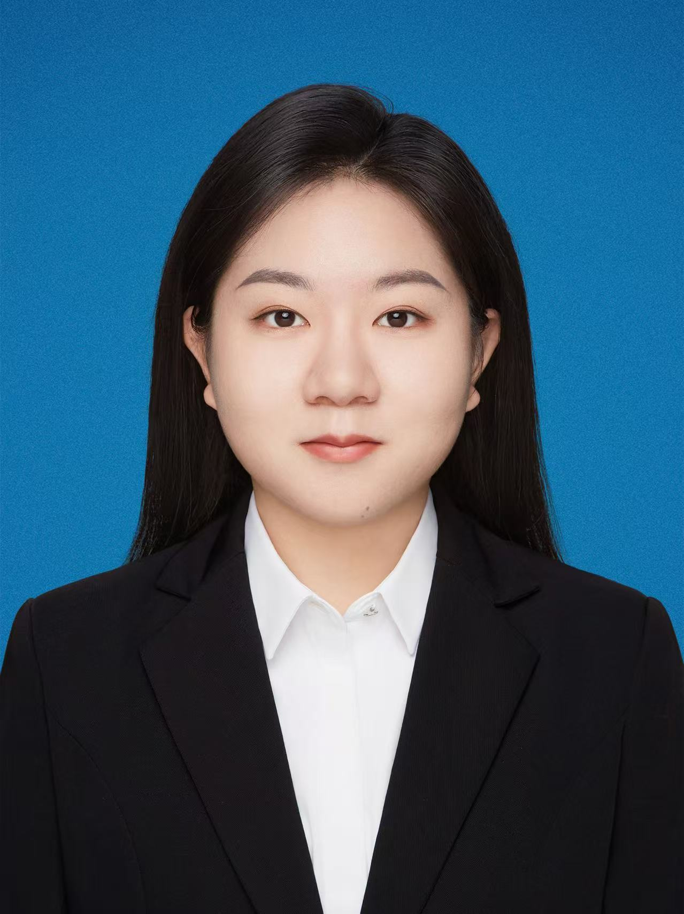

# 📸 照片添加完整指南

您的网站已经更新，现在支持以下位置的照片：

## 🎯 三个主要照片位置

### 1️⃣ 关于页面头像 (最重要)
**位置**: `about.html` 页面顶部  
**文件名**: `images/profile.jpg`  
**推荐规格**:
- 尺寸: 300×300px
- 格式: JPG
- 大小: 50-100KB
- 说明: 清晰的个人头像，建议穿正装

### 2️⃣ 首页项目卡片 (推荐)
**位置**: `index.html` 首页的"最近项目"部分  
**文件名**: 
- `images/project-7verse.jpg` (虚拟人物对话产品)
- `images/project-durian.jpg` (榴莲地图)

**推荐规格**:
- 尺寸: 600×300px
- 格式: JPG
- 大小: 80-120KB
- 说明: 产品截图、界面演示或项目视觉

### 3️⃣ 项目详情页图片 (推荐)
**位置**: `projects.html` 项目详情部分  
**文件名**: 同上
**推荐规格**:
- 尺寸: 800×400px
- 格式: JPG
- 大小: 100-150KB

## 📁 文件夹结构设置

```
personal-website/
├── index.html
├── about.html
├── projects.html
├── css/
│   └── style.css
├── js/
│   └── script.js
└── images/              ← 创建此文件夹
    ├── profile.jpg      ← 你的头像
    ├── project-7verse.jpg
    ├── project-durian.jpg
    └── ...
```

## 🚀 快速操作步骤

### Step 1: 创建 images 文件夹
在 `personal-website` 目录下创建 `images` 文件夹

### Step 2: 准备照片
1. 选择清晰的个人照片（建议穿正装）
2. 使用在线工具压缩：
   - TinyPNG: https://tinypng.com
   - ImageOptim: https://imageoptim.com
   - 在线压缩: https://compressimage.io

3. 保存为JPG格式

### Step 3: 重命名照片
按照以下名称保存在 `images` 文件夹：
- `profile.jpg` - 个人头像
- `project-7verse.jpg` - 7verse项目
- `project-durian.jpg` - Durian Lover项目

### Step 4: 刷新网站
在浏览器中打开网站，按F5或Ctrl+Shift+R强制刷新缓存

## 🎨 自定义照片样式

### 修改头像大小
编辑 `css/style.css`，找到 `.profile-photo` 部分：
```css
.profile-photo {
    width: 180px;      /* 改为你想要的宽度 */
    height: 180px;     /* 改为你想要的高度 */
    border-radius: 50%; /* 保持圆形 */
}
```

### 修改项目图片高度
编辑 `css/style.css`，找到 `.project-image` 部分：
```css
.project-image {
    height: 300px;     /* 改为你想要的高度 */
}
```

## 📊 图片对比说明

| 位置 | 推荐尺寸 | 建议格式 | 文件大小 | 示例 |
|------|---------|---------|---------|------|
| 头像 | 300×300 | JPG | 50-100KB | 正装照 |
| 项目卡片 | 600×300 | JPG | 80-120KB | 产品截图 |
| 项目详情 | 800×400 | JPG | 100-150KB | 详细截图 |

## 🔍 图片不显示？排查步骤

1. **检查文件名**
   - 确保文件名完全正确（区分大小写）
   - `profile.jpg` 不是 `profile.JPG`

2. **检查文件位置**
   - 文件必须在 `images` 文件夹内
   - 不要放在其他位置

3. **检查浏览器缓存**
   - 按 Ctrl+Shift+Delete 清除缓存
   - 或用隐私模式打开网站

4. **检查文件完整性**
   - 确保文件没有损坏
   - 尝试用其他图片测试

## 🌟 添加更多照片的示例

如果想添加更多项目或内容照片：

### 修改 HTML
```html
<!-- 在 projects.html 中添加更多项目 -->
<article class="project-detail">
    <div class="project-image">
        
    </div>
    <h3>GIS空间分析 - 黄河流域</h3>
    ...
</article>
```

## 💡 图片优化技巧

1. **使用正确的格式**
   - 照片: JPG
   - 图标/logo: PNG
   - 简单图形: SVG

2. **压缩大小**
   - 照片不超过150KB
   - 确保网站加载速度快

3. **保持宽高比**
   - 头像: 1:1 (正方形)
   - 项目卡: 2:1 (宽度是高度的2倍)

4. **选择合适的主题**
   - 头像: 清晰、正式、微笑
   - 项目: 展示产品特点、用户界面

## ✨ 高级选项

### 响应式图片（自动适配不同屏幕）
```html
<picture>
    <source media="(max-width: 480px)" srcset="images/profile-small.jpg">
    <source media="(max-width: 768px)" srcset="images/profile-medium.jpg">
    
</picture>
```

### 图片懒加载（加快页面初始加载）
```html

```

## 🎁 免费图片资源网站

如果需要占位符或示例图片：
- Unsplash: https://unsplash.com
- Pexels: https://www.pexels.com
- Pixabay: https://pixabay.com

## 📞 常见问题

**Q: 可以添加多少张照片？**
A: 无限制，但建议保持在5-10张，确保网站加载速度

**Q: 可以改变头像形状吗？**
A: 可以，修改 CSS 中的 `border-radius` 值：
- `border-radius: 50%` = 圆形
- `border-radius: 10px` = 圆角正方形
- `border-radius: 0` = 正方形

**Q: 图片可以是 PNG 格式吗？**
A: 可以，但 JPG 更优化，文件更小

**Q: 如何添加图片水印？**
A: 建议先在图片编辑软件中添加（如 Photoshop、GIMP）

---

**现在您的网站已准备好接受照片！** 🎉
